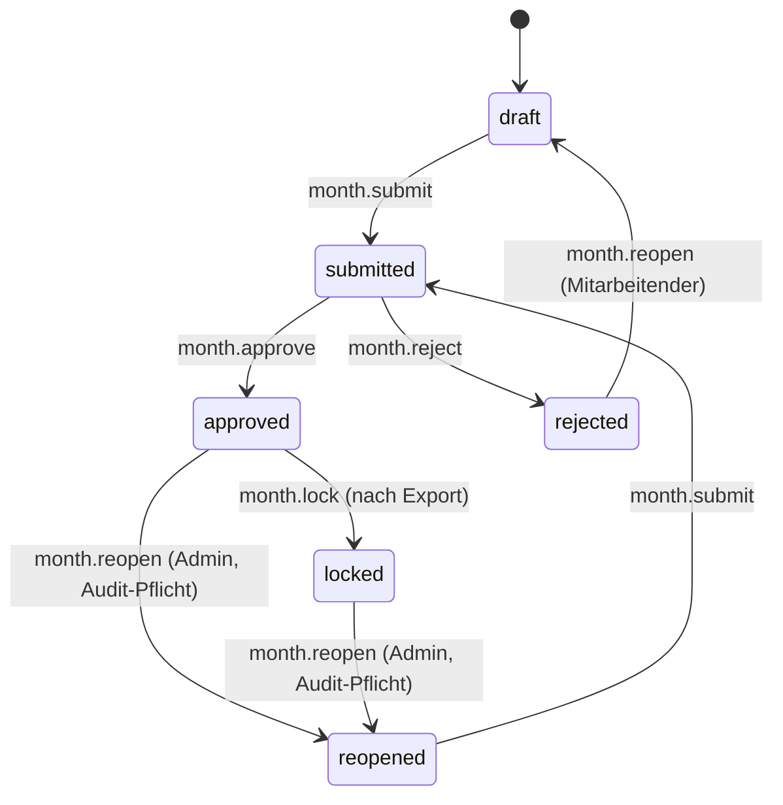

# Monatsfreigabe (Datenmodell)

Status: Aktiv (MVP-016, Issue #16) • Quellen:
[Feature 001 — Zeiterfassung](features/001-zeiterfassung-kernprodukt.md),
[Feature 005 — Lohn/Zuschläge/DATEV](features/005-lohn-zuschlaege-datev-lexware.md).
• Aufbauend auf:
[Tagesabschluss](tagesabschluss.md),
[Status- und Aktionsglossar](status-aktionsglossar.md).

## 1. Zweck

Nach den geschlossenen Tagen (MVP-015) folgt der **Monatsabschluss**:
Mitarbeitende reichen einen Monat ein, Org-Admin prüft, gibt frei oder
weist zur Korrektur zurück. Erst der freigegebene Monat ist die
Grundlage für Lohn- und Rechnungs-Export (MVP-019).

## 2. Datenmodell

### 2.1 `month_closures`

```sql
CREATE TABLE month_closures (
    id                  BIGINT PRIMARY KEY AUTO_INCREMENT,
    organization_id     BIGINT NOT NULL,
    user_id             BIGINT NOT NULL,        -- der Mitarbeitende
    period_year         SMALLINT NOT NULL,
    period_month        TINYINT  NOT NULL,      -- 1..12
    status              VARCHAR(20) NOT NULL,   -- draft|submitted|approved|rejected|reopened|locked
    submitted_at        TIMESTAMP NULL,
    submitted_by_user_id BIGINT NULL,
    decided_at          TIMESTAMP NULL,
    decided_by_user_id  BIGINT NULL,
    decision_note       TEXT NULL,              -- Begründung Freigabe/Ablehnung
    locked_at           TIMESTAMP NULL,         -- gesperrt nach Export
    locked_by_user_id   BIGINT NULL,
    totals              JSON NOT NULL,          -- Snapshot Summen §3
    days_total          SMALLINT NOT NULL,      -- Kalendertage
    days_with_attendance SMALLINT NOT NULL,
    days_closed         SMALLINT NOT NULL,
    days_open           SMALLINT NOT NULL,
    warnings_count      SMALLINT NOT NULL,
    created_at          TIMESTAMP NOT NULL,
    updated_at          TIMESTAMP NOT NULL,
    UNIQUE KEY uniq_user_period (organization_id, user_id, period_year, period_month),
    INDEX idx_status (organization_id, status, period_year, period_month)
);
```

### 2.2 `month_closure_events`

Append-only Audit pro Statuswechsel:

```sql
CREATE TABLE month_closure_events (
    id                  BIGINT PRIMARY KEY AUTO_INCREMENT,
    month_closure_id    BIGINT NOT NULL,
    event               VARCHAR(40) NOT NULL,   -- siehe §5
    actor_user_id       BIGINT NOT NULL,
    note                TEXT NULL,
    payload             JSON NULL,              -- z. B. Diff der totals
    created_at          TIMESTAMP NOT NULL
);
```

### 2.3 Beziehung zu Tagen

Eine Monatsfreigabe verweist nicht auf einzelne `attendance`/`time_entry`-
Zeilen; statt dessen werden alle Tage des Zeitraums über `(user_id,
period)` aggregiert. Beim Übergang `approved → locked` werden die
betroffenen Tage in `day_closures.status = locked` versetzt (siehe
[Tagesabschluss](tagesabschluss.md) §3).

## 3. Snapshot `totals` (JSON)

Beim Wechsel `draft → submitted` und `submitted → approved` wird ein
unveränderlicher Snapshot in `totals` gespeichert:

```json
{
    "soll_hours": 168.0,
    "ist_hours": 171.25,
    "saldo_hours": 3.25,
    "billable_hours": 142.5,
    "nonbillable_hours": 28.75,
    "breaks_hours": 18.5,
    "vacation_days": 0,
    "sick_days": 1,
    "supplements": {
        "night_hours": 4.5,
        "sunday_hours": 0,
        "holiday_hours": 0,
        "oncall_hours": 12
    },
    "warnings": [{ "code": "balance.threshold", "count": 2 }]
}
```

Damit ist die Bemessungsgrundlage für Lohn/Export reproduzierbar und
auditfest.

## 4. Status-Übergänge



Vorbedingungen:

| Übergang           | Aktion                 | Vorbedingung                                               |
| ------------------ | ---------------------- | ---------------------------------------------------------- |
| draft→submitted    | `month.submit`         | alle Tage des Monats `closed`; keine ⛔-Warnung Tag-Level. |
| submitted→approved | `month.approve`        | Permission `month.approve`, optionale Notiz.               |
| submitted→rejected | `month.reject`         | Pflicht-Begründung (≥ 20 Zeichen).                         |
| rejected→draft     | `month.reopen` (Self)  | Mitarbeitender, automatisch.                               |
| approved→reopened  | `month.reopen` (Admin) | Pflicht-Begründung; Tage zurück auf `closed`.              |
| approved→locked    | `month.lock`           | wird durch Export-Job gesetzt (MVP-019).                   |

## 5. Audit-Events

`month.draftStarted`, `month.submitted`, `month.approved`,
`month.rejected`, `month.reopenedBySelf`, `month.reopenedByAdmin`,
`month.locked`, `month.unlocked`.

## 6. Permissions

| Permission                | Wer                                         |
| ------------------------- | ------------------------------------------- |
| `month.view.own`          | Mitarbeitender, eigener Monat.              |
| `month.view.team`         | Teamleitung.                                |
| `month.view.organization` | Org-Admin.                                  |
| `month.submit.own`        | Mitarbeitender.                             |
| `month.approve`           | Org-Admin / Teamleitung.                    |
| `month.reject`            | Org-Admin / Teamleitung.                    |
| `month.reopen`            | Org-Admin (Audit-Pflicht).                  |
| `month.lock`              | System (Export-Job) oder Org-Admin manuell. |

## 7. Akzeptanzkriterien

1. `month_closures` enthält Status-Snapshots und Totals-JSON, ist
   eindeutig pro `(user, year, month)`.
2. Status-Übergänge nur über die definierten Service-Methoden; jede
   Methode erzeugt ein `month_closure_events`-Audit.
3. Submit ist nur möglich, wenn alle Tage `closed` ohne ⛔-Warnungen.
4. Approved-Monat sperrt Tage (`day_closures.status = locked`).
5. Reopen durch Admin trägt Begründung in `decision_note` und Audit.
6. Snapshot in `totals` ist nach Approval **immutable**.
7. Tests prüfen Permissions, Übergänge, Sperrung, Locking.

## 8. Out-of-scope (MVP-016)

- UI für Genehmigungs-Inbox (Folge-MVP).
- Berechnung der konkreten Zuschläge (MVP-019 / DATEV-MVP).
- Sammel-Approval ganzer Teams in einem Klick (Folge).
- Halbmonate / Lohnabrechnungszyklen ≠ Kalendermonat.

## 9. Folge-MVPs

- **MVP-017** Korrekturanträge (kann auch nach Approval greifen).
- **MVP-019** Exportgrundlage für geprüfte Zeiten → setzt `locked`.
- Folge: Inbox „Offene Monatsabschlüsse", Massen-Approval.
