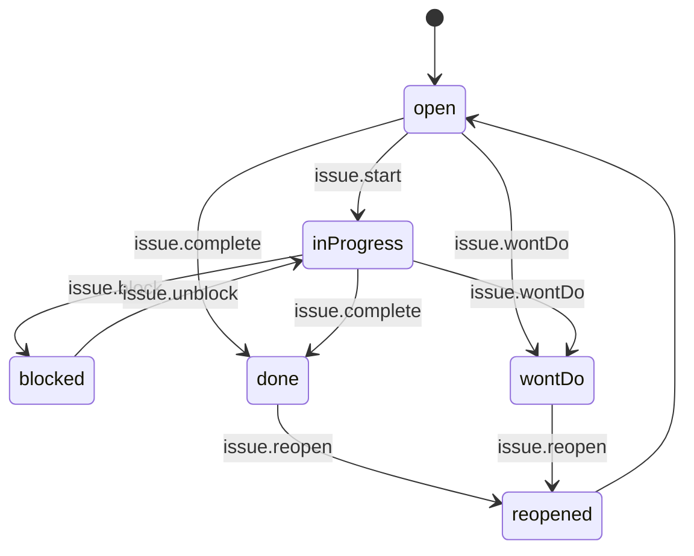

# Offene Punkte (Open Issues / Restpunkte)

Status: Aktiv (MVP-024, Issue #24) • Quelle:
[Feature 003 — Abnahmeprotokolle](features/003-dokumentation-abnahmeprotokolle.md).
• Aufbauend auf:
[Protokoll-Datenmodell](protokoll-datenmodell.md) (MVP-020),
[Protokollpunkt-Typen](protokollpunkt-typen.md) (MVP-021).
• Verbunden mit:
[Auftrags-Timeline](auftrags-timeline.md),
[Fallakte](fallakte.md),
[Status- und Aktionsglossar](status-aktionsglossar.md).

## 1. Zweck

„Offene Punkte" (Restpunkte / Snagging-Items / Mängel mit Nacharbeit)
**strukturiert** mit Verantwortlichkeit, Frist und Status nachhalten —
unabhängig vom Protokoll-Lebenszyklus. So bleibt nachvollziehbar, was
bei Abnahme noch offen war und wann es erledigt wurde.

Quellen:

- Manuell aus Auftragsdetailseite („Offenen Punkt anlegen").
- Automatisch aus `defect`-Punkten eines Protokolls (MVP-021 §3.12).
- Aus Kommunikationsnotizen (`next_action` als Open-Issue, optional).

## 2. Datenmodell

### 2.1 `open_issues`

```sql
CREATE TABLE open_issues (
    id                  BIGINT PRIMARY KEY AUTO_INCREMENT,
    organization_id     BIGINT NOT NULL,
    subject_type        VARCHAR(64) NOT NULL,    -- DiaryEntry|Asset|Project|Customer
    subject_id          BIGINT NOT NULL,
    source_type         VARCHAR(40) NOT NULL,    -- manual|protocolDefect|communicationFollowup
    source_ref_id       BIGINT NULL,             -- Protocol-Item / CommunicationNote ID
    title               VARCHAR(180) NOT NULL,
    description         TEXT NULL,
    category            VARCHAR(40) NULL,        -- aus Klassifikation (MVP-030)
    severity            VARCHAR(20) NOT NULL,    -- low|medium|high|critical
    status              VARCHAR(20) NOT NULL,    -- open|inProgress|blocked|done|wontDo|reopened
    assignee_user_id    BIGINT NULL,             -- Verantwortlich
    due_at              TIMESTAMP NULL,          -- Frist
    visibility          VARCHAR(12) NOT NULL,    -- internal|customer
    closed_at           TIMESTAMP NULL,
    closed_by_user_id   BIGINT NULL,
    closed_reason       TEXT NULL,
    created_by_user_id  BIGINT NOT NULL,
    created_at          TIMESTAMP NOT NULL,
    updated_at          TIMESTAMP NOT NULL,
    deleted_at          TIMESTAMP NULL,
    INDEX idx_subject (subject_type, subject_id, status),
    INDEX idx_assignee_due (assignee_user_id, due_at, status),
    INDEX idx_org_status (organization_id, status, severity)
);
```

### 2.2 `open_issue_events`

```sql
CREATE TABLE open_issue_events (
    id              BIGINT PRIMARY KEY AUTO_INCREMENT,
    open_issue_id   BIGINT NOT NULL,
    event           VARCHAR(40) NOT NULL,    -- siehe §5
    actor_user_id   BIGINT NOT NULL,
    payload         JSON NULL,
    created_at      TIMESTAMP NOT NULL
);
```

Anhänge an offenen Punkten über bestehende `attachments`-Polymorphie
(`attachable_type = OpenIssue`).

## 3. Statusmaschine



Aktionen (Aufnahme ins
[Status-/Aktionsglossar](status-aktionsglossar.md), Domäne `openIssue`):

| Aktion           | Tone    | Vorbedingung                             |
| ---------------- | ------- | ---------------------------------------- |
| `issue.create`   | primary | `view`/`create`-Permission am Subject.   |
| `issue.assign`   | ghost   | Assignment-Permission.                   |
| `issue.start`    | primary | Assignee oder Org-Admin.                 |
| `issue.block`    | warning | Pflicht-Begründung.                      |
| `issue.unblock`  | ghost   |                                          |
| `issue.complete` | success | Pflicht-Notiz (Kurzbeschreibung Lösung). |
| `issue.wontDo`   | warning | Pflicht-Begründung.                      |
| `issue.reopen`   | warning | Begründung; Status zurück auf `open`.    |

## 4. Verantwortlichkeit, Frist, Severity

- **Verantwortlichkeit** (`assignee_user_id`): Pflicht für
  `severity ∈ {high, critical}` und für `status = inProgress`. Bei
  `status = open` darf NULL sein (unzugewiesen).
- **Frist** (`due_at`): Pflicht für `severity = critical` (Default
  `now + 7d`). Für andere Severitys optional.
- **Severity-Defaults**:
    - manuell → `low`
    - aus `protocolDefect` → übernommen aus `value_json.severity`
    - aus `communicationFollowup` → `medium`

## 5. Audit-Events

`issue.created`, `issue.assigned`, `issue.started`, `issue.blocked`,
`issue.unblocked`, `issue.completed`, `issue.wontDo`, `issue.reopened`,
`issue.dueDateChanged`, `issue.severityChanged`,
`issue.commentAdded`, `issue.attachmentAdded`.

## 6. Sichtbarkeit

- `visibility = internal` (Default): nicht im Kundenportal.
- `visibility = customer`: erscheint im Kundenportal an dem Auftrag.
- `closed_reason` ist immer mitsichtbar (kein „still erledigt").

## 7. Permissions

| Permission                    | Wer                             |
| ----------------------------- | ------------------------------- |
| `openIssue.view.own`          | Eigene Aufträge.                |
| `openIssue.view.team`         | Teamleitung.                    |
| `openIssue.view.organization` | Org-Admin.                      |
| `openIssue.create`            | Mitarbeitende.                  |
| `openIssue.update.assignee`   | Assignee, Team-Lead, Admin.     |
| `openIssue.assign`            | Team-Lead, Admin.               |
| `openIssue.publishToCustomer` | Team-Lead, Admin.               |
| `openIssue.delete`            | Org-Admin (Soft-Delete, Audit). |

Kunden-Portal: nur Read, Filter auf `visibility=customer` + eigener
Kunde.

## 8. UI

### 8.1 Fallakte-Sektion (Auftragsdetail)

Sektion §3.6 „Offene Punkte" aus [Fallakte](fallakte.md):

- Liste mit Severity-Pille, Title, Assignee-Avatar, Frist (relative),
  Status-Pille.
- Header-Aktion „Offenen Punkt anlegen".
- Filter: Status, Severity, Assignee.

### 8.2 Dashboard-Widget

„Meine offenen Punkte" auf dem Dashboard, sortiert nach
`due_at ASC NULLS LAST`. Critical-Items rot hervorgehoben.

### 8.3 Detail-Modal

Open-Issue-Detail als `<x-modal>` mit:

- Felder (siehe §2.1)
- Aktivität (`open_issue_events`)
- Kommentare
- Anhänge

## 9. Akzeptanzkriterien

1. `open_issues` mit Polymorphie zu Auftrag/Asset/Projekt/Kunde.
2. `defect`-Protokollpunkte erzeugen beim Speichern automatisch ein
   Open-Issue (Source `protocolDefect`); Verlinkung im Protokoll
   sichtbar.
3. Statusmaschine §3 in `OpenIssueService` mit Tests pro Übergang.
4. Pflichtfelder pro Severity (`critical` → `due_at`+`assignee`).
5. Sichtbarkeitsmatrix für Kunden-Portal serverseitig erzwungen.
6. Audit-Events §5 in `open_issue_events`.
7. Dashboard-Widget zeigt eigene Items nach Frist.
8. Permissions §7 in Policy + Test.

## 10. Out-of-scope (MVP-024)

- Eskalations-Engine (SLA-Verstöße automatisch hochstufen) — Folge.
- Mehrstufige Approval-Workflows — Folge.
- Wiederkehrende offene Punkte (z. B. monatliche Prüfung) — Folge.
- Verknüpfung zu separaten Tickets / Service-Tickets — Folge.

## 11. Folge

- Eskalations-Engine.
- Bulk-Aktionen (z. B. „alle offenen Punkte auf X zuweisen").
- Reports „Top-5 Mängelarten" (MVP-041 verwandt).
