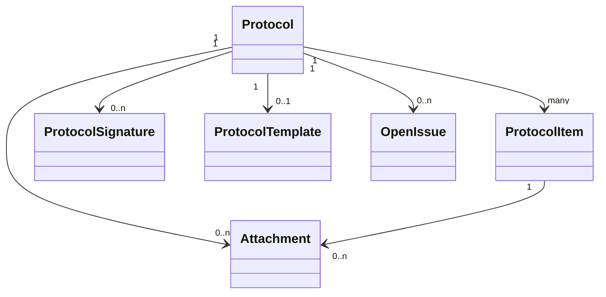
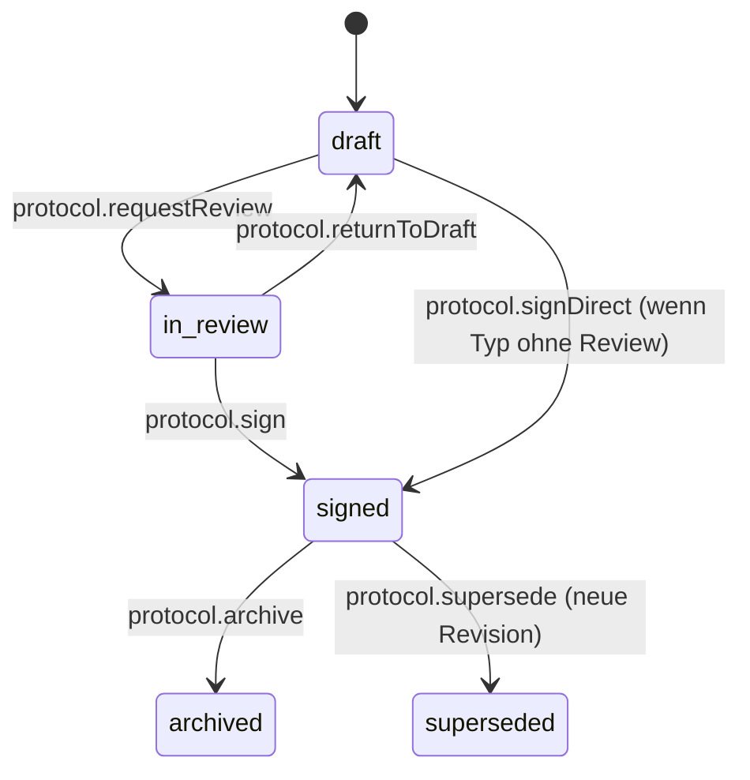

# Protokoll-Datenmodell

Status: Aktiv (MVP-020, Issue #20) • Quelle:
[Feature 003 — Dokumentation und Abnahmeprotokolle](features/003-dokumentation-abnahmeprotokolle.md).
• Verbunden mit:
[Protokollpunkt-Typen](protokollpunkt-typen.md) (MVP-021),
[Abnahme & Signatur](abnahme-signatur.md) (MVP-022),
[Protokoll-Fotos](protokoll-fotos.md) (MVP-023),
[Offene Punkte](offene-punkte.md) (MVP-024),
[Fallakte](fallakte.md),
[Auftrags-Timeline](auftrags-timeline.md).

## 1. Zweck

Strukturiertes Datenmodell für **Baustellen-, Service-, Wartungs-,
Abnahme-, Übergabe-, Mangel-, Prüf-** und sonstige Protokolle.
Grundlage für alle weiteren Protokoll-MVPs (021–024).

Prinzipien:

- **Versionssicher**: Ein einmal abgenommenes Protokoll bleibt
  unverändert. Änderungen erzeugen neue Revision.
- **Strukturiert vor Freitext**: Pflichtfelder als Spalten / typisierte
  Punkte, nicht im Body.
- **Polymorpher Bezug**: An Auftrag, Asset, Projekt, Kunde anhängbar.
- **Audit-pflichtig**: jede Statusänderung mit Aktor + Zeit + Diff.

## 2. Entitäten



## 3. Tabellen

### 3.1 `protocols`

```sql
CREATE TABLE protocols (
    id                  BIGINT PRIMARY KEY AUTO_INCREMENT,
    organization_id     BIGINT NOT NULL,
    type                VARCHAR(40) NOT NULL,    -- siehe §4
    template_id         BIGINT NULL,             -- optional Vorlagen-Bezug
    template_version    INT NULL,                -- gefrorene Vorlagen-Version
    subject_type        VARCHAR(64) NOT NULL,    -- DiaryEntry|Asset|Project|Customer
    subject_id          BIGINT NOT NULL,
    title               VARCHAR(180) NOT NULL,
    description         TEXT NULL,
    state_initial       TEXT NULL,               -- "Zustand bei Beginn"
    state_final         TEXT NULL,               -- "Zustand nach Abschluss"
    status              VARCHAR(20) NOT NULL,    -- draft|in_review|signed|archived|superseded
    revision            INT NOT NULL DEFAULT 1,
    supersedes_id       BIGINT NULL,
    visibility          VARCHAR(12) NOT NULL,    -- internal|customer (Default internal)
    occurred_at         TIMESTAMP NOT NULL,      -- fachliches Datum (z. B. Vor-Ort)
    created_by_user_id  BIGINT NOT NULL,
    created_at          TIMESTAMP NOT NULL,
    updated_at          TIMESTAMP NOT NULL,
    signed_at           TIMESTAMP NULL,
    archived_at         TIMESTAMP NULL,
    INDEX idx_subject (subject_type, subject_id, occurred_at DESC),
    INDEX idx_org_type (organization_id, type, status)
);
```

### 3.2 `protocol_items`

Ein Protokoll besteht aus Punkten (Checklisten-, Mess-, Mangel-, Foto-
Punkten — siehe MVP-021):

```sql
CREATE TABLE protocol_items (
    id                BIGINT PRIMARY KEY AUTO_INCREMENT,
    protocol_id       BIGINT NOT NULL,
    parent_item_id    BIGINT NULL,             -- für Gruppen
    sort_order        INT NOT NULL,
    item_type         VARCHAR(40) NOT NULL,    -- siehe MVP-021 §3
    label             VARCHAR(180) NOT NULL,
    description       TEXT NULL,
    required          BOOLEAN NOT NULL DEFAULT 0,
    value_json        JSON NULL,               -- typisierter Wert (siehe MVP-021)
    result            VARCHAR(20) NULL,        -- ok|notok|n_a|open
    note              TEXT NULL,
    measured_at       TIMESTAMP NULL,
    measured_by_user_id BIGINT NULL,
    INDEX idx_protocol (protocol_id, sort_order)
);
```

### 3.3 `protocol_signatures` (Detail in MVP-022)

```sql
CREATE TABLE protocol_signatures (
    id                BIGINT PRIMARY KEY AUTO_INCREMENT,
    protocol_id       BIGINT NOT NULL,
    role              VARCHAR(40) NOT NULL,   -- customer|contractor|witness
    signer_name       VARCHAR(120) NOT NULL,
    signer_email      VARCHAR(180) NULL,
    signer_contact_id BIGINT NULL,
    signed_at         TIMESTAMP NOT NULL,
    method            VARCHAR(20) NOT NULL,   -- onscreen|portal|emailLink|paper
    signature_image_path VARCHAR(255) NULL,   -- PNG der Unterschrift
    ip                VARCHAR(45) NULL,
    user_agent        TEXT NULL,
    hash              CHAR(64) NOT NULL,      -- siehe MVP-022
    UNIQUE KEY uniq_role (protocol_id, role, signer_name)
);
```

### 3.4 `protocol_events` (Audit-Spur)

```sql
CREATE TABLE protocol_events (
    id            BIGINT PRIMARY KEY AUTO_INCREMENT,
    protocol_id   BIGINT NOT NULL,
    event         VARCHAR(40) NOT NULL,   -- siehe §6
    actor_user_id BIGINT NOT NULL,
    payload       JSON NULL,
    created_at    TIMESTAMP NOT NULL
);
```

### 3.5 Anhänge

Vorhandene polymorphe `attachments`-Tabelle:

- `attachable_type = Protocol` → Anhang am ganzen Protokoll.
- `attachable_type = ProtocolItem` → Anhang am Punkt (siehe MVP-023).

## 4. Protokoll-Typen

| Schlüssel     | Label                       | Pflicht-Signatur? | Pflicht-Foto?  |
| ------------- | --------------------------- | ----------------- | -------------- |
| `acceptance`  | „Abnahmeprotokoll"          | ja (Kunde)        | nein           |
| `service`     | „Serviceprotokoll"          | optional          | nein           |
| `maintenance` | „Wartungsprotokoll"         | optional          | ja (vor/nach)  |
| `handover`    | „Übergabeprotokoll"         | ja (beide Seiten) | nein           |
| `defect`      | „Mängelprotokoll"           | nein              | ja             |
| `inspection`  | „Prüfprotokoll"             | optional          | optional       |
| `siteVisit`   | „Baustellen-Tagesprotokoll" | nein              | ja             |
| `other`       | „Sonstiges"                 | konfigurierbar    | konfigurierbar |

Pflichten werden im Vorlagen-Modell (Folge-MVP-Vorlagen) feiner
konfiguriert; MVP-020 hält die Spalten dafür bereit.

## 5. Status-Maschine



Regeln:

- `draft`: alle Felder frei änderbar, kein Audit-Pflichtdiff pro
  Feldänderung (Speichern aggregiert).
- `in_review`: nur Kommentare/Anhänge/Status-Wechsel.
- `signed`: schreibgeschützt. Korrektur erzeugt **neue Revision** mit
  `supersedes_id` → alte wird `superseded`.
- `archived`: dauerhaft eingefroren; nur Read.

## 6. Audit-Events

`protocol.created`, `protocol.itemAdded/Removed/Reordered`,
`protocol.itemFilled` (mit value/result-Diff),
`protocol.requestedReview`, `protocol.returnedToDraft`,
`protocol.signed` (mit signature_id), `protocol.archived`,
`protocol.supersededBy` (Revision n → n+1),
`protocol.attachmentAdded/Removed`.

## 7. Permissions

| Permission                   | Wer                                                   |
| ---------------------------- | ----------------------------------------------------- |
| `protocol.view.own`          | Sieht Protokolle eigener Aufträge.                    |
| `protocol.view.team`         | Teamleitung.                                          |
| `protocol.view.organization` | Org-Admin.                                            |
| `protocol.create`            | Mitarbeitende.                                        |
| `protocol.edit.draft`        | Erfasser; Org-Admin jederzeit (Draft).                |
| `protocol.requestReview`     | Erfasser / Teamleitung.                               |
| `protocol.sign.internal`     | Teamleitung / Org-Admin.                              |
| `protocol.sign.customer`     | Kunde (Portal) / Mitarbeitender vor Ort (im Beisein). |
| `protocol.archive`           | Org-Admin.                                            |
| `protocol.supersede`         | Org-Admin (Pflicht-Begründung).                       |

## 8. Integration

- **Auftrags-Timeline**: jedes Audit-Event aus §6 erscheint dort
  (Event-Typ `protocol.*`).
- **Fallakte** §3.7 Sektion „Protokolle & Abnahmen": Liste der
  Protokolle mit Status + Typ + Revision.
- **Globale Suche** (MVP-014): `title`, `state_initial`, `state_final`,
  Item-`label`/`note` werden indiziert.

## 9. Akzeptanzkriterien

1. Tabellen aus §3 mit Constraints und Indizes vorhanden.
2. Status-Maschine §5 in Service-Klasse `ProtocolService` mit Tests
   pro Übergang.
3. Signiertes Protokoll ist read-only; Korrektur erzeugt neue Revision
   (`supersedes_id` + `superseded`).
4. Polymorphe Anhänge an Protocol und ProtocolItem funktionieren.
5. Permissions §7 in Policy + Test.
6. Audit-Events §6 in `protocol_events` + spiegeln in `audit_logs`.
7. Auftrags-Timeline zeigt Protokoll-Ereignisse korrekt.

## 10. Out-of-scope (MVP-020)

- Konkrete Item-Typen (MVP-021).
- Signatur-Capture-UI / PDF (MVP-022).
- Vorher-/Nachher-Foto-Logik (MVP-023).
- Offene-Punkte-Workflow (MVP-024).
- Vorlagen-Versionierung jenseits `template_version`-Snapshot (Folge).

## 11. Folge-MVPs

Direkt: 021, 022, 023, 024. Später: Wiederverwendbare
Protokollvorlagen mit Versionierung; QR-Code am Asset.
