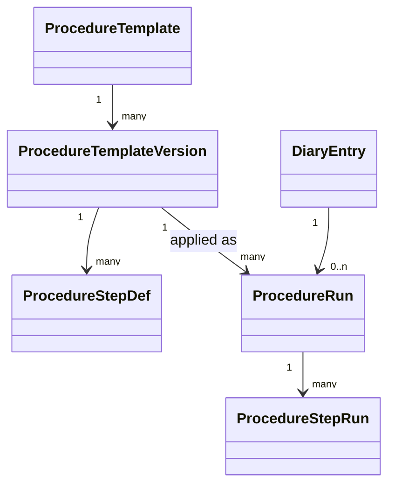

# Prozedurvorlagen

Status: Aktiv (MVP-025, Issue #25) • Quelle:
[Feature 026 — Prozeduren/Arbeitsanweisungen/Checklisten](features/026-prozeduren-arbeitsanweisungen-checklisten.md).
• Verbunden mit:
[Protokoll-Datenmodell](protokoll-datenmodell.md),
[Protokollpunkt-Typen](protokollpunkt-typen.md) (`procedure_step`),
[Prozedur-Pflicht & Reihenfolge](prozedur-pflicht.md) (MVP-026),
[Nachweistyp Backup](prozedur-backup.md) (MVP-027),
[Vier-Augen-Freigabe](prozedur-vier-augen.md) (MVP-028),
[Prozedur-Abweichungen](prozedur-abweichungen.md) (MVP-029).

## 1. Zweck

Versionssichere **Vorlagen** für wiederkehrende Abläufe (Update,
Wartung, Inbetriebnahme, Tausch …), die auf Aufträge / Protokolle /
Assets angewendet werden. Ein Auftrag erhält eine **Instanz** der
Vorlage in der zum Zeitpunkt der Anwendung gültigen Version — spätere
Vorlagen-Änderungen ändern alte Aufträge nicht.

## 2. Entitäten



## 3. Tabellen

### 3.1 `procedure_templates`

```sql
CREATE TABLE procedure_templates (
    id              BIGINT PRIMARY KEY AUTO_INCREMENT,
    organization_id BIGINT NOT NULL,
    code            VARCHAR(60) NOT NULL,         -- z. B. "FW_UPDATE_ROUTER"
    name            VARCHAR(180) NOT NULL,
    description     TEXT NULL,
    domain          VARCHAR(40) NULL,             -- branche/scope: it|hvac|electric|…
    active          BOOLEAN NOT NULL DEFAULT 1,
    created_at      TIMESTAMP NOT NULL,
    updated_at      TIMESTAMP NOT NULL,
    UNIQUE KEY uniq_code (organization_id, code)
);
```

### 3.2 `procedure_template_versions`

```sql
CREATE TABLE procedure_template_versions (
    id                      BIGINT PRIMARY KEY AUTO_INCREMENT,
    procedure_template_id   BIGINT NOT NULL,
    version                 INT NOT NULL,        -- 1, 2, 3 …
    valid_from              DATE NOT NULL,
    valid_to                DATE NULL,           -- NULL = aktuell
    change_note             TEXT NULL,
    published_at            TIMESTAMP NULL,
    published_by_user_id    BIGINT NULL,
    risk_level              VARCHAR(20) NOT NULL DEFAULT 'normal', -- low|normal|high|critical
    applicability           JSON NULL,           -- siehe §4
    created_at              TIMESTAMP NOT NULL,
    UNIQUE KEY uniq_version (procedure_template_id, version),
    INDEX idx_valid (procedure_template_id, valid_from, valid_to)
);
```

### 3.3 `procedure_step_defs`

```sql
CREATE TABLE procedure_step_defs (
    id                              BIGINT PRIMARY KEY AUTO_INCREMENT,
    procedure_template_version_id   BIGINT NOT NULL,
    sort_order                      INT NOT NULL,
    code                            VARCHAR(60) NOT NULL,  -- z. B. "BACKUP_CONFIG"
    step_type                       VARCHAR(40) NOT NULL,  -- siehe §5
    label                           VARCHAR(180) NOT NULL,
    description                     TEXT NULL,
    required                        BOOLEAN NOT NULL DEFAULT 1,
    blocking                        BOOLEAN NOT NULL DEFAULT 1, -- blockiert Folgeschritte (MVP-026)
    config                          JSON NULL,             -- typ-spezifisch (z. B. tolerance)
    required_role                   VARCHAR(40) NULL,
    required_qualification_code     VARCHAR(60) NULL,
    requires_second_person          BOOLEAN NOT NULL DEFAULT 0, -- MVP-028
    requires_proof_type             VARCHAR(40) NULL,      -- backup|file|photo|measure|signature
    UNIQUE KEY uniq_step (procedure_template_version_id, code),
    INDEX idx_order (procedure_template_version_id, sort_order)
);
```

### 3.4 `procedure_runs` (Instanz pro Auftrag)

```sql
CREATE TABLE procedure_runs (
    id                              BIGINT PRIMARY KEY AUTO_INCREMENT,
    organization_id                 BIGINT NOT NULL,
    procedure_template_version_id   BIGINT NOT NULL,       -- gefrorene Version
    subject_type                    VARCHAR(64) NOT NULL,  -- DiaryEntry|Asset
    subject_id                      BIGINT NOT NULL,
    status                          VARCHAR(20) NOT NULL,  -- open|inProgress|blocked|completed|aborted
    assigned_user_id                BIGINT NULL,
    started_at                      TIMESTAMP NULL,
    completed_at                    TIMESTAMP NULL,
    aborted_at                      TIMESTAMP NULL,
    abort_reason                    TEXT NULL,
    created_by_user_id              BIGINT NOT NULL,
    created_at                      TIMESTAMP NOT NULL,
    updated_at                      TIMESTAMP NOT NULL,
    INDEX idx_subject (subject_type, subject_id, status)
);
```

### 3.5 `procedure_step_runs`

```sql
CREATE TABLE procedure_step_runs (
    id                          BIGINT PRIMARY KEY AUTO_INCREMENT,
    procedure_run_id            BIGINT NOT NULL,
    procedure_step_def_id       BIGINT NOT NULL,
    status                      VARCHAR(20) NOT NULL,  -- pending|done|n_a|failed|deviated|blocked
    value_json                  JSON NULL,             -- typisierter Eingabewert
    executed_by_user_id         BIGINT NULL,
    executed_at                 TIMESTAMP NULL,
    second_person_user_id       BIGINT NULL,           -- MVP-028
    second_person_signed_at     TIMESTAMP NULL,
    proof_attachment_id         BIGINT NULL,           -- MVP-027 / Nachweis
    note                        TEXT NULL,
    deviation_id                BIGINT NULL,           -- MVP-029
    INDEX idx_run (procedure_run_id),
    UNIQUE KEY uniq_step (procedure_run_id, procedure_step_def_id)
);
```

### 3.6 `procedure_run_events`

Append-only Audit: `procedure.runStarted`, `procedure.stepCompleted`,
`procedure.stepFailed`, `procedure.stepDeviated`,
`procedure.runCompleted`, `procedure.runAborted`,
`procedure.secondPersonAssigned`, `procedure.secondPersonSigned`.

## 4. Anwendungsbereich (`applicability`)

JSON, das beschreibt, **wann eine Vorlage automatisch greift**:

```json
{
  "diary_entry_type": ["service", "maintenance"],
  "asset_categories": ["router", "firewall"],
  "customer_ids": null,
  "tags_any": ["fw-update"]
}
```

Service `ProcedureApplicabilityResolver` matcht beim Auftrag-Anlegen
und schlägt passende Vorlagen vor. Manuelle Zuweisung ist immer
möglich.

## 5. Schritt-Typen (`step_type`)

Analog [Protokollpunkt-Typen](protokollpunkt-typen.md):

| Schlüssel        | Beschreibung                                  |
| ---------------- | --------------------------------------------- |
| `confirm`        | „Bestätigen, dass …".                         |
| `text`           | Freitext-Eingabe.                             |
| `number`         | Messwert (mit Toleranz in `config`).          |
| `choice`         | Auswahl.                                      |
| `photo`          | Pflichtfoto.                                  |
| `file`           | Pflichtdatei (MIME-Whitelist).                |
| `backup`         | siehe MVP-027.                                |
| `signature`      | Unterschrift (in-line).                        |
| `material`       | Materialverbrauch erfassen.                   |
| `dienstmittel`   | Genutztes Dienstmittel/Tool erfassen.         |
| `freigabe`       | Vier-Augen-Freigabe (MVP-028).                |
| `messreihe`      | Messreihe (timestamped samples).              |
| `link_protocol`  | Verweis: hier zugehöriges Protokoll anlegen.  |
| `link_test`      | Funktionstest mit Ergebnis ok/nok.            |

## 6. Versionierung und Veröffentlichung

- Nur **publishierte** Versionen (`published_at NOT NULL`) sind
  anwendbar.
- Vor `published_at` ist die Version `draft` und nur für Org-Admin
  sichtbar.
- Publish setzt `valid_from` (default heute) und schließt die vorherige
  Version (`valid_to = valid_from - 1 day`).
- Eine Schritt-Definition kann nach Publish **nicht** mehr geändert
  werden — Korrekturen erzeugen neue Version.

## 7. Permissions

| Permission                            | Wer                                |
| ------------------------------------- | ---------------------------------- |
| `procedure.template.view`             | Mitarbeitende.                     |
| `procedure.template.create`           | Org-Admin / Qualitätsmanagement.   |
| `procedure.template.publish`          | Org-Admin / Qualitätsmanagement.   |
| `procedure.run.start`                 | Mitarbeitende (mit Rollen-Check).  |
| `procedure.run.abort`                 | Org-Admin oder Run-Initiator.      |
| `procedure.run.view`                  | Wer Subject sehen darf.            |

## 8. Akzeptanzkriterien

1. Tabellen §3 mit Constraints und Indizes.
2. Publish-Workflow setzt `valid_from`/`valid_to` korrekt; Schritte
   sind nach Publish unveränderlich.
3. `ProcedureApplicabilityResolver` schlägt Vorlagen bei Auftrag-
   Anlegen vor (Tests pro Matching-Regel).
4. `ProcedureRun` friert `procedure_template_version_id` ein — Update
   der Vorlage ändert offene Runs nicht.
5. Audit-Events §3.6 vollständig.
6. Permissions §7 in Policy + Test.

## 9. Out-of-scope (MVP-025)

- Bedingte Schritte (if-then) — Folge.
- Visueller Prozedur-Designer — Folge.
- Schritt-Bibliothek (wiederverwendbare Schritte über Vorlagen
  hinweg) — Folge.
- Import aus bestehenden Dokumenten — Folge.

## 10. Folge

- MVP-026 Pflicht + Reihenfolge.
- MVP-027 Nachweistyp Backup.
- MVP-028 Vier-Augen.
- MVP-029 Abweichungen.
