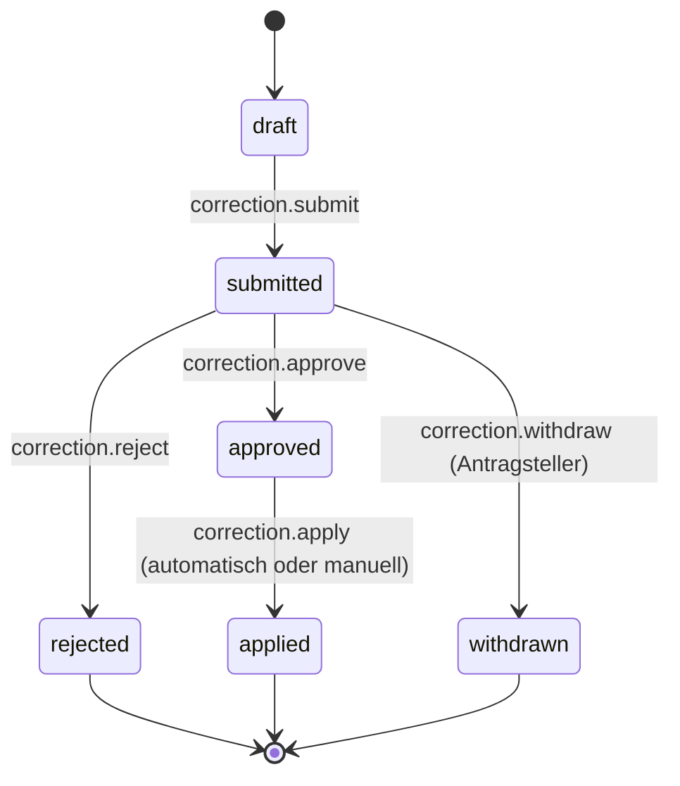

# Zeitkorrektur-Anträge

Status: Aktiv (MVP-017, Issue #17) • Quellen:
[Feature 001 — Zeiterfassung](features/001-zeiterfassung-kernprodukt.md),
[Feature 006 — Compliance/Korrekturen/Audit](features/006-compliance-korrekturen-audit.md).
• Aufbauend auf:
[Tagesabschluss](tagesabschluss.md),
[Monatsfreigabe](monatsfreigabe.md),
[Status- und Aktionsglossar](status-aktionsglossar.md).

## 1. Zweck

Eine **revisionsfeste**, beantragbare Änderung von bereits abgeschlossenen
Zeitdaten (Tag oder Monat). Korrekturen werden nicht still überschrieben,
sondern als Antrag mit Begründung, Diff und Genehmigungsspur erfasst.

Anwendungsfälle:

- Vergessene Stempelung nachtragen.
- Falscher Auftrag → richtiger Auftrag.
- Doppelte Buchung entfernen.
- Pause vergessen.
- Falsche Pausenlänge.
- Abrechnungsstatus (billable) ändern.

## 2. Fachliche Schneidung

| Korrektur-Scope     | Beispiele                                       |
| ------------------- | ----------------------------------------------- |
| `attendance.entry`  | Stempel-Zeitpunkt verschoben/ergänzt/gelöscht.  |
| `time_entry.field`  | Auftrag, Aktivität, Dauer, Kommentar, billable. |
| `time_entry.create` | Neue Buchung nachtragen.                        |
| `time_entry.delete` | Buchung entfernen (mit Begründung).             |
| `break.adjust`      | Pausen-Marker setzen/verschieben.               |

Ein Antrag bündelt **eine atomare Änderung pro betroffenem
Quell-Datensatz**, kann aber mehrere `change_items` enthalten (z. B.
„drei Buchungen umhängen").

## 3. Datenmodell

### 3.1 `time_correction_requests`

```sql
CREATE TABLE time_correction_requests (
    id                 BIGINT PRIMARY KEY AUTO_INCREMENT,
    organization_id    BIGINT NOT NULL,
    user_id            BIGINT NOT NULL,         -- Mitarbeitender (Betroffener)
    requested_by_user_id BIGINT NOT NULL,        -- Antragsteller (meist = user_id)
    scope_date         DATE NOT NULL,            -- Tag, auf den sich Antrag bezieht
    status             VARCHAR(20) NOT NULL,     -- draft|submitted|approved|rejected|applied|withdrawn
    reason             TEXT NOT NULL,            -- Pflichtbegründung
    decided_at         TIMESTAMP NULL,
    decided_by_user_id BIGINT NULL,
    decision_note      TEXT NULL,
    applied_at         TIMESTAMP NULL,
    created_at         TIMESTAMP NOT NULL,
    updated_at         TIMESTAMP NOT NULL,
    INDEX idx_user_date (user_id, scope_date),
    INDEX idx_status (organization_id, status)
);
```

### 3.2 `time_correction_items`

```sql
CREATE TABLE time_correction_items (
    id                  BIGINT PRIMARY KEY AUTO_INCREMENT,
    time_correction_request_id BIGINT NOT NULL,
    target_type         VARCHAR(40) NOT NULL,   -- Attendance|TimeEntry|Break
    target_id           BIGINT NULL,            -- NULL bei create
    action              VARCHAR(20) NOT NULL,   -- create|update|delete
    before              JSON NULL,              -- Snapshot vor Änderung
    after               JSON NULL,              -- Wunschzustand
    INDEX idx_request (time_correction_request_id)
);
```

### 3.3 Verknüpfung Audit

Beim Übergang `approved → applied` werden die Änderungen wirksam und
erzeugen pro Item ein reguläres `audit_logs`-Event mit
`changes = {before, after}` und `event = "<target>.correctedByApproval"`.
Der Original-Antrag (ID) wird im Payload referenziert.

## 4. Status-Übergänge



Vorbedingungen:

- `submit`: nicht-leere `items`, valider `reason` ≥ 20 Zeichen.
- `approve`: Permission `correction.approve`.
- `apply`: Idempotent, prüft, dass Quell-Datensätze noch existieren und
  in der Zwischenzeit nicht in einem `locked` Monat sind. Wenn `locked`,
  muss zuerst `month.reopen` erfolgen (Admin) — sonst Übergang abgelehnt
  mit Fehler `monthLocked`.

## 5. Anwendbarkeit je nach Sperrstatus

| Zustand des Quell-Datensatzes          | Möglich?                                                |
| -------------------------------------- | ------------------------------------------------------- |
| Tag `open`                             | direkte Bearbeitung; kein Antrag nötig.                 |
| Tag `closed`                           | Antrag erforderlich.                                    |
| Tag `correction`                       | Antrag erforderlich; Liste angereichert.                |
| Tag in Monat `submitted/approved`      | Antrag erforderlich + Admin-Approval.                   |
| Tag in Monat `locked` (Export erfolgt) | `correction.apply` nur nach `month.reopen` durch Admin. |

## 6. Audit-Events

- `correction.created`
- `correction.submitted`
- `correction.withdrawn`
- `correction.approved`
- `correction.rejected`
- `correction.applied` (mit Liste der erzeugten Datensatz-Events)
- `correction.applyFailed` (mit Fehlerursache, kein Statuswechsel)

## 7. Permissions

| Permission                     | Wer                      |
| ------------------------------ | ------------------------ |
| `correction.create.own`        | Mitarbeitender.          |
| `correction.submit.own`        | Mitarbeitender (eigene). |
| `correction.withdraw.own`      | Antragsteller.           |
| `correction.approve`           | Org-Admin / Teamleitung. |
| `correction.reject`            | Org-Admin / Teamleitung. |
| `correction.apply.system`      | System / Admin.          |
| `correction.view.team`         | Teamleitung.             |
| `correction.view.organization` | Org-Admin.               |

## 8. UI-Pattern

- Antrag-Erstellung direkt aus Tagesabschluss-Seite (Aktion
  `day.requestCorrection` öffnet vorgefüllten Antrag mit Diff-Editor
  je Item).
- Antragsliste für Mitarbeitende: „Meine Korrekturen" auf Dashboard.
- Genehmigungs-Inbox für Org-Admin: Liste „Offene Korrekturanträge"
  mit Diff-Anzeige (Pattern Datei-Diff: rote Zeilen `before`, grüne
  Zeilen `after`).
- Aktionen pro Antrag aus dem
  [Status-/Aktionsglossar](status-aktionsglossar.md): `approve`
  (tone success), `reject` (tone error, Begründung Pflicht),
  `apply` (success, nur nach approve).

## 9. Akzeptanzkriterien

1. Korrekturen an `closed` Tagen erfordern Antrag; an `open` Tagen
   nicht.
2. Antrag enthält Pflicht-`reason` ≥ 20 Zeichen + ≥ 1 Item mit
   `before`/`after`.
3. Status-Übergänge laut §4 erzeugen alle Audits aus §6.
4. Korrektur an Tag in `locked` Monat verlangt vorher `month.reopen`;
   sonst Fehler `monthLocked`.
5. `apply` ist **idempotent** (zweimaliges Anwenden ergibt denselben
   Endzustand).
6. Diff-Anzeige zeigt before/after pro Item lesbar.
7. Permissions §7 in Policy + Test.
8. Withdraw nur durch Antragsteller, nur bis `submitted`.

## 10. Out-of-scope (MVP-017)

- Bulk-Korrekturen über mehrere Tage in einem Antrag (späteres MVP).
- Korrekturen an `MaterialUsage`/`TravelLog`/`Expense` (separate MVPs).
- Vorschlags-Bot (z. B. „Pause fehlt, jetzt nachtragen?") — Folge.

## 11. Folge-MVPs

- **MVP-018** Plan/Ist-Abgleich nutzt Korrekturhistorie zur Erklärung
  von Abweichungen.
- **MVP-019** Export berücksichtigt `applied`-Korrekturen.
- Folge: Massen-Korrekturen, Bot-Vorschläge.
